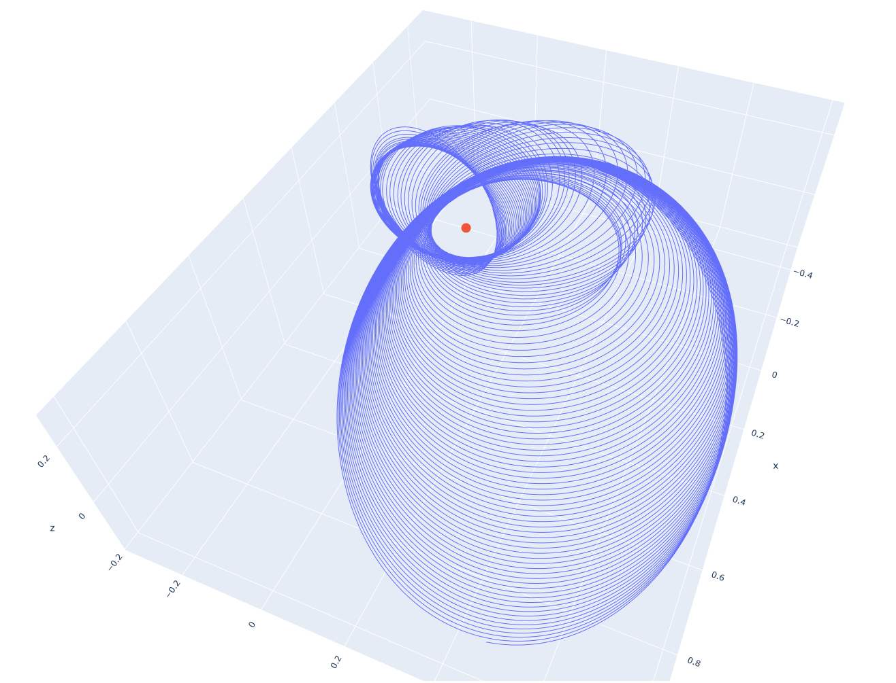
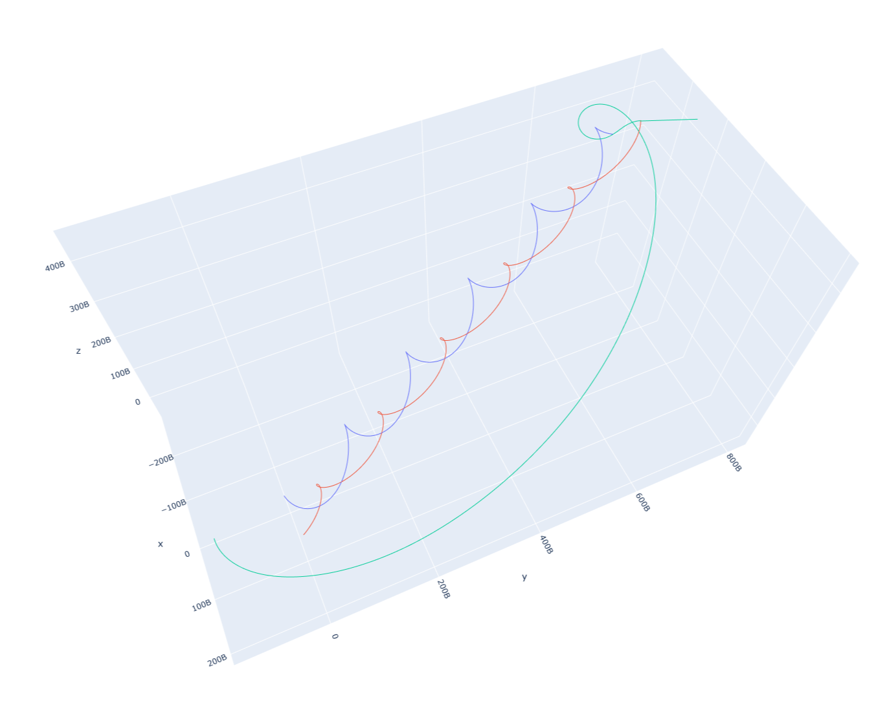
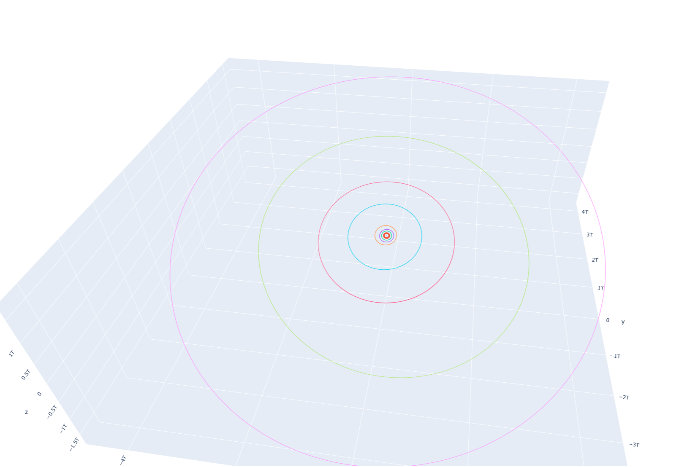

# Solar System and 1/2/3 body problems

This repository contains 6 files and 2 of them are "playgrounds" which I have change and have fun throughout my Differential Equation exam.

Those files do not contain solution for well know "3 body problem" but contain simplifier version of it using Newtonian equations.

Image of solution for 1 body problem: 

Image of solution for 3 body problem: 

Image of solution for solar system: 
 

As can be seen, the planets' trajectories are circular rather than elliptical due to the simplification involved in using the Newtonian equation.